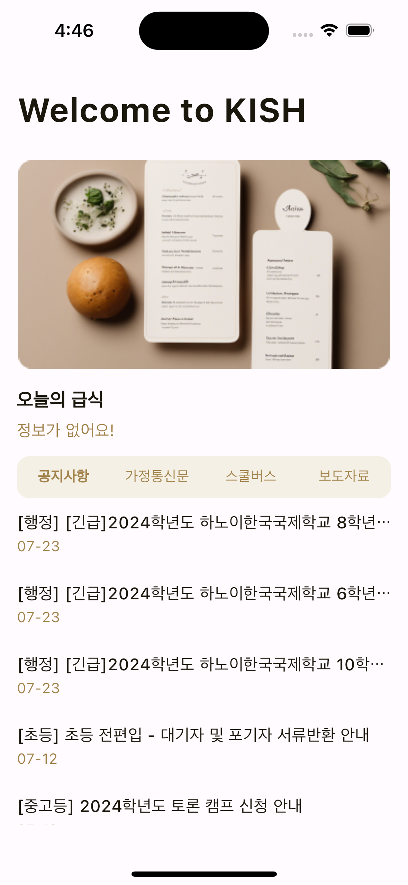

# Pocket KISH

하노이한국국제학교 학생 편의 앱

## 프로젝트 설명
이 프로젝트는 하노이한국국제학교 학생들의 편의를 위해 제작된 애플리케이션입니다. 이 애플리케이션은 학교 홈페이지의 내용을 클라이언트에서 직접 읽어옵니다. [KISH_APP](https://github.com/KISH-students/KISH_app) 프로젝트와는 달리, 추가적인 서버가 필요하지 않습니다. 현재 이 앱이 제공하는 기능은 다음과 같습니다:

- 급식 정보 조회
- 4개의 카테고리에 대한 최신 게시물 조회

## 기여하기
이 프로젝트는 누구나 기여할 수 있으며, 자유롭게 수정하여 사용할 수 있습니다.